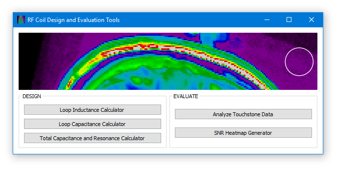

# RFCoilTools
RF Coil Design and Evaluation Tools

## Installation
Requires Python 3.
1. Click *Code* > *Download ZIP*
2. Extract the .zip file into a directory of your choice
3. In Command Prompt **cd** to the chosen directory
4. Run the command:
`py -3 setup.py install`

## Running the Application

`py -3 MAIN_MENU.py`

## Features

Tools are devided into two categories: design and evaluation. Design tools are suited for estimating the necessary electrical components before building an RF coil. Evaluation tools are used in the coil testing phase to process network and MRI image data.

### Main Menu

  

### Loop Inductance Calculator

  

### Loop Capacitance Calculator

  

### Total Capacitance and Resonance Calculator

  

  

### Analyze Touchstone Data

  

  

### SNR Heatmap Generator

  

  

## Licenses

This software is released under the [MIT License](LICENSE).

Graphics generated from the [MNI MRI dataset](http://nist.mni.mcgill.ca/?p=935) under their [MIT License](https://github.com/WilliamMathieu/RFCoilTools/blob/master/MNI%20Dataset%20License).
